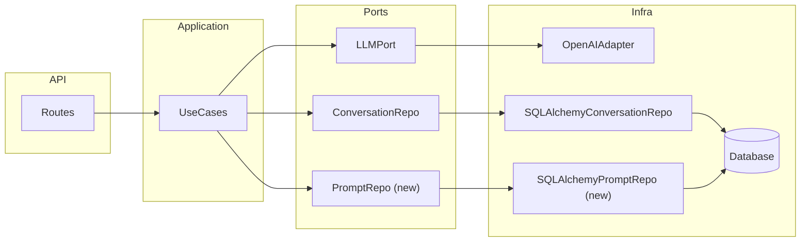

# Prompts from database and contract (discussion plan)

## Current state

- **Prompts:** In-code only in [app/domain/prompt_registry.py](app/domain/prompt_registry.py): a `PROMPTS` dict and `get_prompt(slug)` returning a `PromptSpec` (name, system_prompt). Use cases import `get_prompt` directly.
- **DB:** SQLite via [app/infra/persistence/db.py](app/infra/persistence/db.py); models in [app/infra/persistence/models.py](app/infra/persistence/models.py) (Conversation, Message, Run). No YAML anywhere in the repo.
- **Wiring:** [app/main.py](app/main.py) injects `settings` and `llm` on `app.state`; routes use `Depends(get_session)` and build `ConversationRepo` and `LLMPort` from that. Use cases are called with explicit args and have no injected prompt loader.

So "avoid going through YAML" means: **do not introduce YAML**; go straight from the current in-code registry to DB-backed resolution. No intermediate YAML file or loader.

---

## 1. Contract for prompts (domain + port)

- **Domain** keeps the **shape** of a prompt: keep (or move) `PromptSpec` in domain — e.g. in [app/application/ports.py](app/application/ports.py) as a TypedDict or in a small `app/domain/prompts.py` if you want domain to own only types.
- **Port:** Add a `PromptRepo` (or `GetPromptPort`) in [app/application/ports.py](app/application/ports.py):
  - `get_prompt(slug: str) -> PromptSpec` (fallback to default when slug is missing or unknown is a policy choice: either in the port’s doc/impl or in the use case).
- **Use cases** in [app/application/use_cases.py](app/application/use_cases.py) stop importing `get_prompt` from domain; they receive a **callable** or the port (e.g. `get_prompt: Callable[[str], PromptSpec]` or a `PromptRepo` instance) and call it to resolve `instructions` from the chosen slug. So the application layer depends on the port, not on a concrete module.

This gives a clear contract: "something that, given a slug, returns a PromptSpec."

---

## 2. Load prompts from the database (infra)

- **New table `prompts`:** Add a model in [app/infra/persistence/models.py](app/infra/persistence/models.py), e.g.:
  - `slug` (PK, string, unique)
  - `name` (string, human-readable label)
  - `system_prompt` (text)
  - Optional: `created_at` / `updated_at` for auditing.
- **New repo:** In [app/infra/persistence/](app/infra/persistence/) (e.g. `repo_sqlalchemy.py` or a dedicated `prompt_repo.py`), implement the port: e.g. `SQLAlchemyPromptRepo.get_prompt(slug) -> PromptSpec`. On "slug not found", return a default (e.g. fetch slug `"default"` or a hard-coded fallback) so behaviour stays stable.
- **Seeding:** Ensure the same two prompts that exist today (`default`, `conflict-coach-v1`) are present in the DB. Options: one-off migration script, or a small "seed if empty" in lifespan (or a separate CLI). No YAML: seed from code or from a minimal JSON/SQL file if you prefer to edit text outside code.
- **Wiring:** In [app/main.py](app/main.py) lifespan, build the prompt repo (using `get_session`-style session handling) and put it on `app.state.prompt_repo` (or pass a `get_prompt` callable built from it). In [app/api/routes.py](app/api/routes.py), add a dependency that returns the prompt repo (or the callable); pass it into the use case calls (e.g. `chat(..., get_prompt=...)`). Use cases stay pure: they receive the resolver and call it.

Result: prompts are loaded from the DB as soon as a request needs them; no YAML in the pipeline.

---

## 3. "Real" database (Postgres vs SQLite)

- **Short term (ASAP):** Use the **existing** SQLite and add the `prompts` table + repo. No change to `database_url` or engine setup beyond creating the new table. This satisfies "load prompts from the database asap" and avoids any YAML.
- **Later ("real" DB):** [app/infra/persistence/db.py](app/infra/persistence/db.py) and [app/settings.py](app/settings.py) already use a single `database_url`; [RISKS-AND-IMPROVEMENTS.md](RISKS-AND-IMPROVEMENTS.md) already notes SQLite is for local/demo. To move to Postgres (or another engine):
  - Set `DATABASE_URL` to a Postgres URL (e.g. in prod or Docker Compose).
  - Optionally add a small amount of engine config (e.g. pool size) for Postgres; SQLite-specific bits (e.g. `check_same_thread`, `StaticPool` for in-memory) stay behind `if database_url.startswith("sqlite")` so both work.

So: **prompts from DB ASAP on current SQLite**; **upgrade to Postgres (or other) when you want a "real" DB** without redoing the prompt contract or the repo interface.

---

## 4. Summary diagram

---

## 5. Tests and docs

- **Unit/integration:** Use cases can be tested with a in-memory or fake prompt resolver (e.g. a dict or a small stub that returns a fixed `PromptSpec`). Existing tests that rely on `prompt_slug` (e.g. [tests/test_chat.py](tests/test_chat.py)) can keep using a mock that returns a known prompt.
- **DB-backed tests:** Integration tests that use the real SQLite (or in-memory SQLite) should seed the `prompts` table so that `default` and any slug used in tests exist.
- **Docs:** Update [README.md](README.md) / [RISKS-AND-IMPROVEMENTS.md](RISKS-AND-IMPROVEMENTS.md) to state that prompts are stored in the database and that the contract is the `PromptRepo` port; mention optional Postgres when moving to a "real" DB.

---

## 6. What we are not doing

- **No YAML:** No YAML files or YAML-based prompt loading; prompts are either in-code (current) or in DB (target).
- **No big routes refactor in this slice:** Routes stay as-is for this change; only add a dependency for the prompt repo and pass it into use cases. Thinning routes can be a separate improvement.
- **No mandatory Postgres for "prompts from DB":** Postgres can be a follow-up; the prompt contract and DB-backed repo work with the current SQLite setup.

If you want, the next step can be a concrete implementation plan (file-by-file diffs) for the contract + prompts table + repo + wiring and seeding, or we can narrow scope (e.g. "only add the port and one implementation" first).